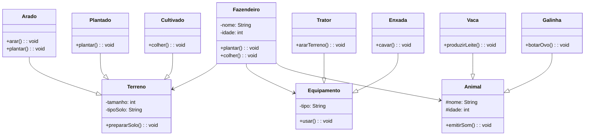

```mermaid
classDiagram

    class Fazendeiro {
        -nome: String
        -idade: int
        +plantar(): void
        +colher(): void
    }

    class Terreno {
        -tamanho: int
        -tipoSolo: String
        +prepararSolo(): void
    }

    class Arado {
        +arar(): void
        +plantar(): void
    }

    class Plantado {
        +plantar(): void
    }

    class Cultivado {
        +colher(): void
    }

    class Equipamento {
        -tipo: String
        +usar(): void
    }

    class Trator {
        +ararTerreno(): void
    }

    class Enxada {
        +cavar(): void
    }

    class Animal {
        #nome: String
        #idade: int
        +emitirSom(): void
    }

    class Vaca {
        +produzirLeite(): void
    }

    class Galinha {
        +botarOvo(): void
    }

    Fazendeiro --> Terreno
    Fazendeiro --> Equipamento
    Fazendeiro --> Animal

    Arado --|> Terreno
    Plantado --|> Terreno
    Cultivado --|> Terreno

    Trator --|> Equipamento
    Enxada --|> Equipamento

    Vaca --|> Animal
    Galinha --|> Animal
```
